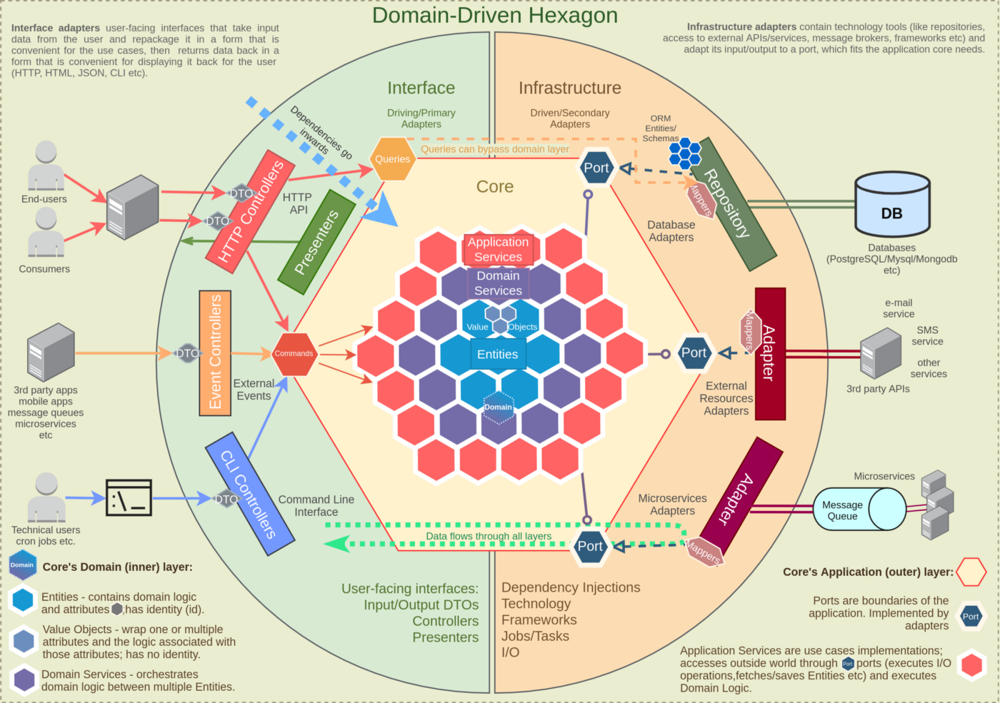

# GO Application Structure using DDD HEX Architecture
How to structure your GO application.
  

  
## Directory Setup  
1. `go env | grep GOPATH`  
> GOPATH = D:/GO  
2. `mkdir -p D:/GO/{bin, src, pkg}`  
3. `cd src && mkdir hex`   
4. `cd hex && go mod init`  
...  
...  
...  
  
## gRPC - Google Remote Procedure Call  
Documentation
> gRPC : https://grpc.io/docs/languages/go/  
> Download Protocol Buffer : https://github.com/protocolbuffers/protobuf/releases/tag/v3.19.1  
  
#### Prerequisites  
- **Go**
- **Protocol Buffer** compiler, `protoc`, version 3  
> https://github.com/protocolbuffers/protobuf/releases  
>> download protoc-3.19.1-win64.zip  
>> move protoc.exe to $PATH  
- **Go Plugins**  
> Install the protocol compiler plugins for Go using the following commands:  
>> $ go install google.golang.org/protobuf/cmd/protoc-gen-go@v1.26
>> $ go install google.golang.org/grpc/cmd/protoc-gen-go-grpc@v1.1  
  
> Update your PATH so that the protoc compiler can find the plugins:  
>> $ export PATH="$PATH:$(go env GOPATH)/bin"  
  
#### Commands
1. `protoc --go_out=internal\adapters\framework\left\grpc --proto_path=internal\adapters\framework\left\grpc\proto internal\adapters\framework\left\grpc\proto\number_msg.proto` - Run this command once number_msg.proto file configured.  
2. `protoc --go-grpc_out=require_unimplemented_servers=false:internal\adapters\framework\left\grpc --proto_path=internal\adapters\framework\left\grpc\proto internal\adapters\framework\left\grpc\proto\arithmetic_svc.proto` - Run this command once arithmetic_svc.proto file configured.  
  
## Docker
Documentation  
> Download docker : https://docs.docker.com/desktop/windows/install/  
> WSL2 for Windows : https://docs.microsoft.com/en-gb/windows/wsl/install-manual#step-4---download-the-linux-kernel-update-package  
> Docker compose file v3 : https://docs.docker.com/compose/compose-file/compose-file-v3/  
  
#### Commands
1. `docker compose up --build` - Run this command in the same directory as docker-compose.yaml file to build the docker image.  
2. `docker compose down` - To bring down the container.    
  
  
***Reference : https://www.youtube.com/watch?v=MpFog2kZsHk***  